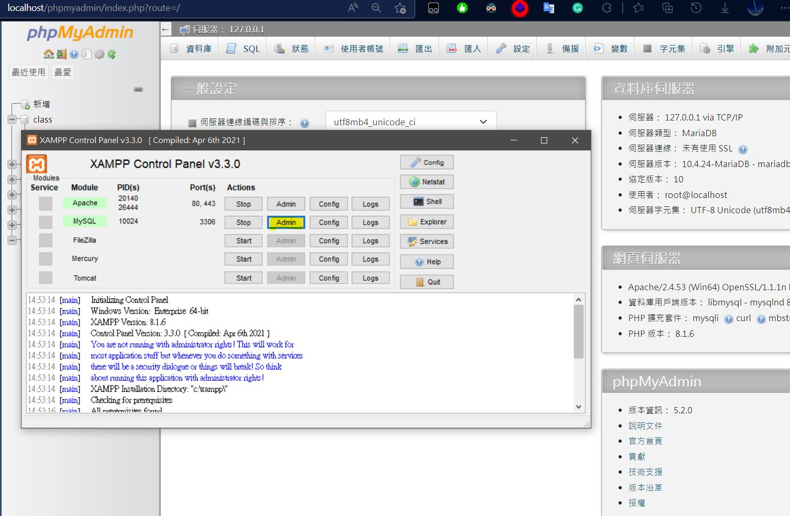
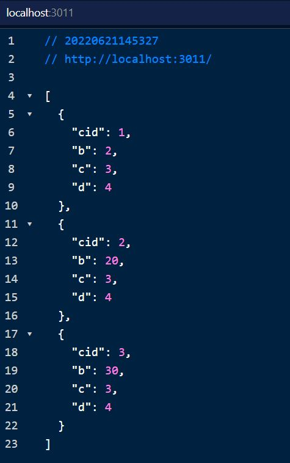

1-1

請先安裝 MySQL [參考連結](https://hackmd.io/@dpes5407/HkPyqOpu9)

1-2

安裝 [JSON viewer](https://chrome.google.com/webstore/detail/json-viewer/gbmdgpbipfallnflgajpaliibnhdgobh)

2-1
執行 XAMPP 的
`Apache`
`MySQL`

2-2 點 MySQL 的 Admin 或打[網址](http://localhost/phpmyadmin/index.php?route=/)到管理介面

使用SQL.txt塞資料進去DB

3

cd 到 mysql
node 執行 node index.js

