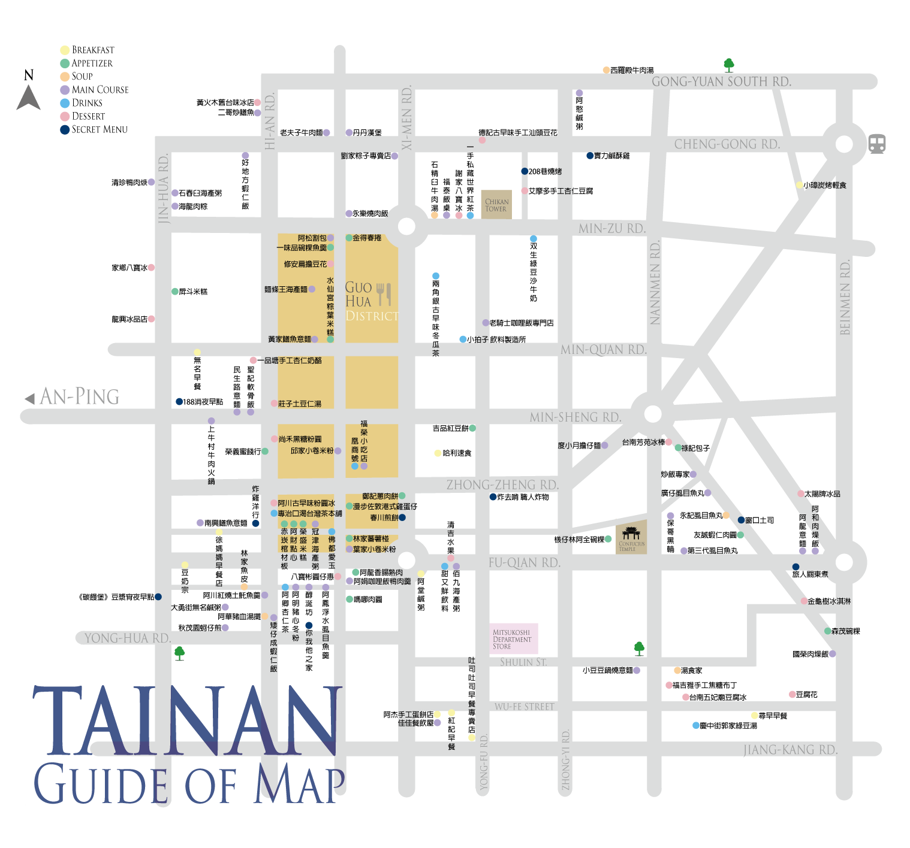

# 重點整理

- 導航範例
  `https://www.google.com/maps/dir/?api=1&destination=${地點名稱}`
  "https://www.google.com/maps/dir/?api=1&destination=新北市五股區自強路56號"

- 搜尋範例
  `https://www.google.com/maps/search/${地點名稱}`
  https://www.google.com/maps/search/逢甲大學

- 重點
  img 裡面有個屬性 usemap="`#${your_map_name}`"

```html

<!-- coords=X1,Y1,X2,Y2(左上右下座標) -->
<!-- shape為符號 -->
<map name="map_1">
  <area
    target="_blank"
    href="https://www.google.com/maps/search/戽斗米糕"
    alt="戽斗米糕"
    title="Hu-Dou Savory Rice Cake"
    shape="rect"
    coords="286,480,346,493"
  />
</map>
```
